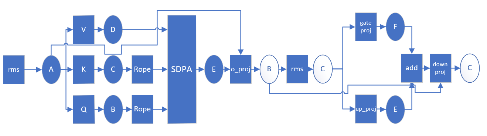

# Memory Estimation Usage
## 0. Estimation Assumption
* Runtime buffers are reused among different atttention blocks, ellipse refers to output memory of each node, while ellipses refers to resued buffer, blue ellipse refers to allocated buffer.

* Temp buffer here refers to output memory of each Op
* Rope is not inplace since only specific ROPE such as Rotate-half could be inplace.
* input/output of models are all placed in devices
* After images are embedded by Conv2D, the only memory used is the embedded image size which is `[seq_length, hidden_size]`
## 1. Estimate LLM model
```bash
python3 estimate_llm.py <ov model folder> <seq_length>
# Example output
Total runtime memory 3.14 GB
```
## 2. Estimate VIT model
```bash
python3 estimate_vit.py <ov model folder> <seq_length>
# Example output
Total VIT Runtime Memory 1.72 GB weight 1.24 GB temp 0.48 GB
```
## 3. Estimate VLM pipline
### 3.0 Input Data
- Image Size W x H: `1024 * 682`
- Prompt: `Please Describe this picture`
```bash
python3 estimate_vlm.py <ov model folder> <seq_length>
```
### 3.1 Estimate qwen2_5-3b-vl
```bash
# Example output
python3 estimate_vlm.py ov-qwen2_5-3b-vl 7252
Total VIT Runtime Memory 1512.24 MB weight 1275.41 MB temp 236.83 MB
Total LLM Runtime Memory 6030.02 MB weight 5885.96 MB temp 144.06 MB
Total VIT + LLM + Embeddings Runtime Memory 8135.76 MB
# OV 13GB
# Llama.cpp 9234 MB
```
| Name | Memory(MB) | Ratio |
| :--- | :---: | :---: |
| OV | 13312 | 163 % |
| Llama.cpp | 9234 | 113 % |
| Estimation | 8135.76 | baseline |
### 3.2 Estimate internvl2_5-4b
```bash
# slices 7  output_channel 1024 class_channel 1 7175 = 7 * 1025
python3 ./estimate_vlm.py /mnt/llm_irs/zhangyi7/ov-internvl2_5-4b/ 7175
Total VIT Runtime Memory 786.06 MB weight 603.88 MB temp 182.18 MB
Total LLM Runtime Memory 6030.15 MB weight 5884.94 MB temp 145.22 MB
Total VIT + LLM + Embeddings Runtime Memory 7408.69 MB
# OV 7500 MB
# Llama.cpp 7672 MB
```
| Name | Memory(MB) | Ratio |
| :--- | :---: | :---: |
| OV | 7500 | 101 % |
| Llama.cpp | 7672 | 104 % |
| Estimation | 7408.69 | baseline |

### 3.3 Estimate minicpm-v-2-5-4bit
```bash
# patch_nums 5, size 1014
python3 ./estimate_vlm.py /mnt/llm_irs/zhangyi7/ov-minicpmv/OV_FP16-4BIT_DEFAULT/ 5070
Total VIT Runtime Memory 609.14 MB weight 465.81 MB temp 143.33 MB
Total LLM Runtime Memory 3805.63 MB weight 3752.89 MB temp 52.74 MB
Total VIT + LLM + Embeddings Runtime Memory 4933.45 MB
# OV 5400 MB
# Llama.cpp 6530 MB
```
| Name | Memory(MB) | Ratio |
| :--- | :---: | :---: |
| OV | 5400 |  109 % |
| Llama.cpp | 6530 | 132 % |
| Estimation | 4933.45 | baseline |
### 3.4 Estimate gemma-3-4b-it-f16
```bash
python3 ./estimate_vlm.py gemma-3-4b-it-f16 4096
Total VIT Runtime Memory 913.00 MB weight 800.75 MB temp 112.25 MB
Total LLM Runtime Memory 7449.76 MB weight 7401.02 MB temp 48.75 MB
Total VIT + LLM + Embeddings Runtime Memory 9643.08 MB
#OV 9800 MB
#Llama.cpp 10914MiB
```
| Name | Memory(MB) | Ratio |
| :--- | :---: | :---: |
| OV | 9800 | 102 % |
| Llama.cpp | 10914 | 113 % |
| Estimation | 9643.08 | baseline |
### 3.5 Estimate llava-1.5-7b-hf-4bit
```bash
python3 ./estimate_vlm.py llava-1.5-7b-hf-4bit 577
Total VIT Runtime Memory 314.69 MB weight 300.04 MB temp 14.65 MB
Total LLM Runtime Memory 3521.60 MB weight 3334.98 MB temp 186.62 MB
Total VIT + LLM + Embeddings Runtime Memory 3961.60 MB
#OV ~ 4500 MB
#Llama.cpp 7392 MB
```
| Name | Memory(MB) | Ratio |
| :--- | :---: | :---: |
| OV | 4500 | 113 % |
| Llama.cpp | 7392 | 187 % |
| Estimation | 3961.60 | baseline |
### 3.6 Estimate phi-3.5-vision-instruct-fp16
```bash
# patch 5, encoded_image_length 577
python3 ./estimate_vlm.py phi-3.5-vision-instruct-fp16 5*577
Total VIT Runtime Memory 670.13 MB weight 596.88 MB temp 73.25 MB
Total LLM Runtime Memory 7272.51 MB weight 7100.26 MB temp 172.25 MB
Total VIT + LLM + Embeddings Runtime Memory 8130.51 MB
# OV 8500 MB
```
| Name | Memory(MB) | Ratio |
| :--- | :---: | :---: |
| OV | 8500 | 105 % |
| Llama.cpp | N/A | N/A |
| Estimation | 8139.38 | baseline |